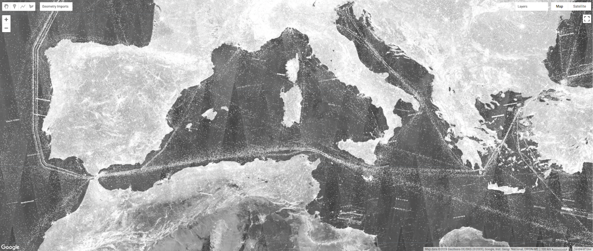

# CFAR detector for Sentinel-1 with GEE

Library for detecting vessels and offshore infrastructure in SAR imagery with a Constant False Alarm Rate algorithm, using the Python API of Google Earth Engine.

> **_NOTE:_**  The workflow relies on Google Cloud Storage and BigQuery

## Content

**Codebase**

    .
    ├── README.md               # this file
    ├── config.yaml             # params and paths for detection run
    ├── detect_vessels.py       # run a multi-scene vessel detector
    ├── detect_scene.py         # run a single-scene detector
    ├── detect_infra.py         # run a fixed-infrastructure detector
    ├── detect_shore.py         # run a close-to-shore detector
    ├── export_foots.py         # run a footprint generator
    ├── upload_detect.py        # download/process/upload detections
    ├── upload_foots.py         # download/process/upload footprints
    ├── core
    │   ├── __init__.py
    │   ├── checks.py           # name check helper functions
    │   ├── cloud.py            # gcs and bq helper functions
    │   ├── detector.py         # the various `Detector` classes
    │   ├── footprint.py        # the `ExportFootprint` class
    │   ├── gee.py              # functions to interact with GEE
    │   ├── params.py           # the `Params` class
    │   ├── ranges.py           # date, tile, and window range iterators
    │   └── utils.py            # generic helper functions
    ├── scripts
    │   ├── eval_detect.py      # assess matched detections
    │   ├── interp_ais.py       # get AIS positions close to a scene
    │   ├── locate_sat.py       # calculate Sentinel-1 positions
    │   ├── match_detect.py     # match detections to AIS
    │   ├── match_detect.yaml   # set params for the matching run
    │   ├── rasterize_foot.py   # create overpass raster for N days
    │   └── set_params.py       # replace/add params to PARAMS files 
    ├── assets                  # supporting SQL code for the matching
    └── untracked               # location to place credential files

**Main classes**

    Params              # handles input parameters, files and table names
    Detector            # applies CFAR to a generic EE image object
    DetectorVessel      # applies `Detector` to a collection of scenes
    DetectorInfra       # applies `Detector` to an image composite
    DetectorInfraShore  # applies `DetectorInfra` to inshore/land area
    ExportFootprint     # applies `DetectorVessel` to get footprints only

## Examples

### Run detections for specific dates (in this order)

Define dates and params in the YAML file (or pass as argument in script, see below):  

    config.yaml

Run CFAR detector on all dates/scenes with Earth Engine (this exports to GCS as geojson), by calling the detector classes and functions in a user-defined script (see below for example), say  

    run_detector.py

Download detections to local machine, convert from geojson to CSV, and upload to BigQuery:  

    # Option 1: S1A and S1B are processed toguether (same instance -> same outdir)

    upload_detect.py --replace path/to/PARAMS_*

    # Option 2: S1A and S1B are processed separately (different VMs -> diff outdirs)

    upload_detect.py -s common_subbucket_name --append path/to/PARAMS_S1A*  
    upload_detect.py -s common_subbucket_name --append path/to/PARAMS_S1B*

    # Option 3: By region_id (if defined) to same subbucket (fixed infrastructure) 

    upload_detect.py -a path/to/PARAMS_*

Match AIS and VMS to SAR detections [you'll need the footprints on BQ, see below]:  

    # Option 1: Match all generated PARAMS files (single outdir)

    match_detect.py path/to/PARAMS_*

    # Option 2: Match specific params/files from YAML file (multi outdir)

    match_detect.py path/to/match_detect.yaml

Evaluate all matches (this uses the footprint polygons generated below):  

    # Option 1: Evaluate all generated PARAMS files  

    eval_detect.py path/to/PARAMS_*

    # Option 2: Evaluate specific params/files from YAML file  

    eval_detect.py path/to/match_detect.yaml  # same file as above

### Compute footprint polygons (needed for matching)

Create a vector footprint for each scene and export the polygon to GCS as geojson:  

    # This is the same detection script with `export_footprint=True`  

    export_foots.py {the_date} {n_days} [sat]

Download footprints to local, convert to well known text, and upload to bigquery:  

    # Option 1: Upload all generated PARAMS files  

    upload_foots.py path/to/footprints/PARAMS_*

    # Option 2: Upload specified days  

    upload_foots.py 2020-05-01 30

Rasterize footprint polygons in bigquery (at 0.05 deg resolution) [only needed for analysis]:  

    rasterize_foots.py {the_date} {n_days} [version]

### Interpolate AIS positions (needed for matching)

Interpolate AIS positions to the time of each scene and vessel (detection) locations:  

    interp_ais.py {the_date} {n_days} [version]

### User-made script examples

Run vessel detection for specific days, create `run_detector.py` as   

    from detector import DetectorVessel
    from utils import date_range

    for date in date_range('2020-01-01', '2020-12-30'):
        DetectorVessel(
            date=date,
            satellite="S1A",
            suffix="_a",
            thresholdx=22,
            resolution=20,
            window_inner=140,
            window_outer=240,
            dialation_radius=60,
        ).process(folder='outdir', skip_done=True)

Run fixed-infrastructure detection for time window:

    from detector import DetectorFixed
    from utils import tile_range

    # Define time window for composite
    date1, date2 = ("2020-01-01", "2020-12-30")

    # Define AOI, e.g. West Hemisphere
    xmin, xmax, ymin, ymax = (-180, 0, -90, 90)

    # Tiles are further divide into subtiles internaly
    for k, reg in enumerate(tile_range(xmin, xmax, ymin, ymax, 20, 20)):
        DetectorFixed(
            region=list(reg),  # use list for now
            region_id=f"WEST_{k:02}",
            satellite="both",
            orbit="both",
            suffix="",
            thresholdx=21,
            resolution=20,
            window_inner=140,
            window_outer=200,
            window_date=[date1, date2],
            dialation_radius=45,
            max_num_images=40,
            min_num_images=5,
            tile_dx=1,
            tile_dy=1,
        ).process(folder='outdir', check=True, every=60.0)

Export detection footprints for a few scenes:

    from detector import ExportFootprint

    scenes = [
        "S1A_IW_GRDH_1SDV_20180104T062704_20180104T062729_020001_02211F_22E3",
        "S1B_IW_GRDH_1SDV_20200201T051926_20200201T051951_020071_025FC9_324B",
        "S1A_IW_GRDH_1SDV_20200201T003833_20200201T003902_031052_039134_3DA3",
    ]

    subbucket = "20m_500s_500b_1p_vh_foot"

    for scene_id in scenes:
        ExportFootprint(
            scene_id=scene_id,
            subbucket=subbucket,
            satellite='S1A',
            foot_scale=500,
            foot_buffer=500,
            foot_percentile=1,
            foot_usevv=False,
        ).process(folder='outdir', skip_done=True)

### Errors

In Earth Engine, an argument being null is usually the same as it being omitted. Hence, a call to Image.constant with the value null will produce the error Image.constant: Parameter 'value' is required.

    "state": "FAILED",
    "task_type": "EXPORT_FEATURES",
    "error_message": "Image.constant: Parameter 'value' is required.",

    => No detections to export

https://tinyurl.com/2p8a353m
